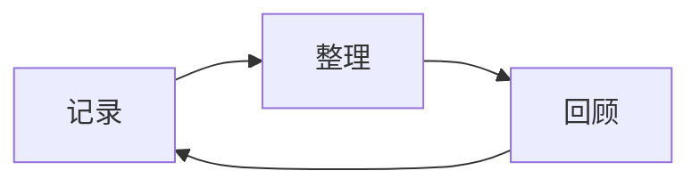

# 公式与流程图

公式与 Mermaid 由本地预览库渲染，源码仍保留为普通 Markdown 文本。

## 行内公式

平均值为 $\bar{x}=\frac{1}{n}\sum_{i=1}^{n}x_i$。

## 块级公式

$$
E = mc^2
$$

## Mermaid

```mermaid
flowchart LR
  A[记录] --> B[整理]
  B --> C[回顾]
  C --> A
```

非法公式或图表显示局部错误提示，不影响其他正文。
