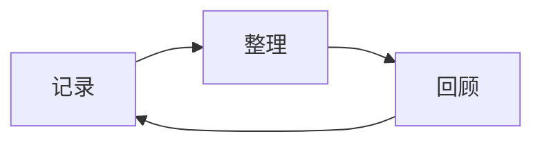

# 公式与流程图

公式和 Mermaid 是目标样式样本，当前 App 尚未接入对应渲染库。

## 行内公式

平均值为 $\bar{x}=\frac{1}{n}\sum_{i=1}^{n}x_i$。

## 块级公式

$$
E = mc^2
$$

## Mermaid

```mermaid
flowchart LR
  A[记录] --> B[整理]
  B --> C[回顾]
  C --> A
```

在完整支持前，源码必须保留，其他正文不应受到影响。
